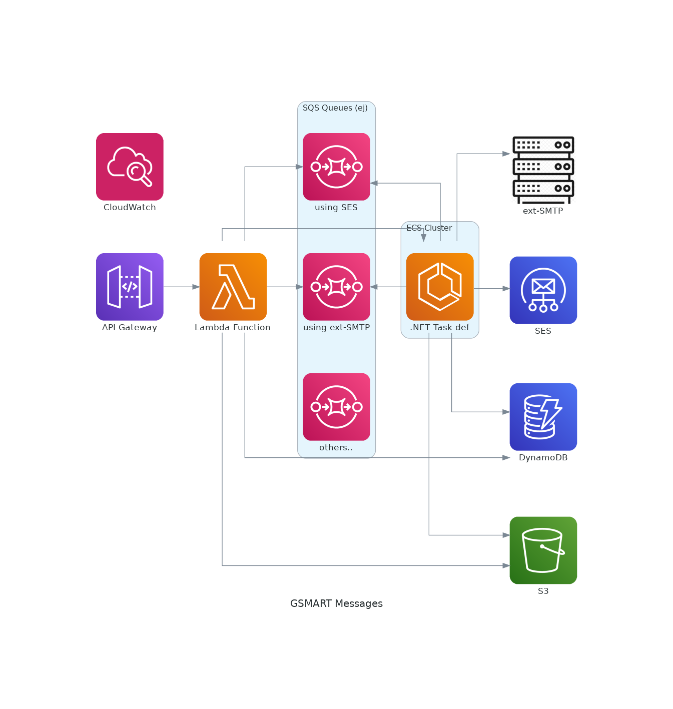

# poc-gsmart-messages
POC GSMART MESSAGES
- Fecha: 09/2024
- Plataforma: AWS

### Resumen de Nuevo Diseño del Módulo de Mensajes

#### 0. **Descripción General del Sistema**

El diagrama representa una alternativa al sistema de mensajes para la aplicación "GSMART". Este módulo está pensado para el envío y recepción de mensajes interno de GSMART a través de diferentes servicios de AWS con la mínima intervención manual posible, utilizando una combinación de servicios gestionados para asegurar alta disponibilidad, escalabilidad y flexibilidad.

#### 1. **Componentes Principales**
- **API Gateway**: Actúa como punto de entrada al módulo, gestionando las solicitudes HTTP y redirigiéndolas a las funciones **Lambda** para su procesamiento dependiendo del método definido al que la petición llame.

- **Lambda Function**: Procesan las solicitudes entrantes desde el API Gateway. Basado en la lógica de negocio, se decide cómo manejar la solicitud, ya sea enviándolo a una cola concreta de SQS, anotando el éxito o fallo en la tabla de dynamodb...etc

- **SQS Queues**: Utilizadas para desacoplar el procesamiento de mensajes, garantizando que se manejen de manera asíncrona y escalable. Las colas son utilizadas tanto por SES como por el servicio externo SMTP, de forma que según la clasificación que se realice desde Lambda, se registrará en una cola determinada para no bloquear o ralentizar otro tipo de mensajes ante posibles problemas (Mensajes relacionados con la actividad interna del sistema, mensajes que requieren más tiempo de procesamiento (por subir archivos a S3) reintentos de correos fallidos tras un tiempo determinado..etc)

- **ECS Cluster (.NET Task Definition)**: Esta definición de tarea( Deployment en Kubernetes) en ECS está pensado para ejecutar tareas de procesado (en .NET en principio), lo que permite el procesamiento más complejo de mensajes y otras operaciones. Las tareas pueden incluir el envío de correos electrónicos a través de SES, recuperación de correos recibidos de DynamoDB o S3 si exiten adjuntos, y otras operaciones necesarias. ( Nota: esta parte es posible distribuirla a funciones Lambda dependiendo de requisitos que se acuerden )

#### 2. **Componentes complementarios**
- **SES (Simple Email Service)**: Servicio gestionado de AWS utilizado para enviar correos electrónicos a direcciones externas para clientes que no tienen configuración de salida SMTP propia

- **ext-SMTP**: para casos en los que se requiere integración con sistemas de correo específico.  

- **DynamoDB**: Base de datos NoSQL utilizada para almacenar toda la información de los mensajes procesados, tales como registros de envíos, recepción, metadatos o información de seguimiento.

- **S3 (Simple Storage Service)**: Se utiliza para almacenar datos y archivos de gran tamaño relacionados con los mensajes, como adjuntos o logs de procesamiento.

- **CloudWatch**: Servicio de monitorización que recolecta y visualiza métricas, logs y eventos del sistema. Abierto a reemplazo por otra solución SaaS

#### 3. **Ejemplo de flujo común de Trabajo**
1. **Solicitud Entrante**: Un cliente envía una solicitud de mensaje a través del **API Gateway**.
2. **Enrutamiento del Mensaje**: La **Lambda Function** procesa la solicitud, clasificando el mensaje en una cola SQS específica, así como tareas complementarias en otros servicios.
4. **Procesamiento**: Tareas específicas pueden ser manejadas por contenedores en ECS (o nuevas funciones), que interactúan con DynamoDB para almacenar/recuperar/eliminar información o con S3 para almacenamiento de archivos.
5. **Monitoreo y Registro**: **CloudWatch** monitorea toda la actividad, generando la trazabilidad mediante logs y métricas.

#### 4. **Plan de Tareas**

#### **Duración Total Estimada**: 9-12 semanas

#### 1. **Alcance y Requerimientos (1 Semana)**
   - **Tarea 1.1**: Reunir a las partes interesadas para definir los objetivos y documentar los casos de uso y escenarios clave que la POC debe cubrir.
   - **Tarea 1.2**: Identificar las métricas de éxito para evaluar la POC, como por ejemplo, tiempos de respuesta, tasa de entrega de mensajes... , así como asegurar el acceso y permisos necesarios en la cuenta de AWS para los recursos requeridos.

#### 2. **Re-diseño de la Arquitectura y Preparación del Entorno (1-2 Semanas)**
   - **Tarea 2.1**: Crear y documentar la arquitectura detallada en función del diagrama acordado.
   - **Tarea 2.2**: Implementar y configurar monitoreo básico con CloudWatch.

#### 3. **Desarrollo e Implementación de la POC (3-4 Semanas)**
   - **Tarea 3.1**: Desarrollar la lógica en Lambda para procesar las solicitudes del API Gateway.
   - **Tarea 3.2**: Integrar Lambda con los servicios de mensajería (SES y ext-SMTP) y colas SQS.
   - **Tarea 3.3**: Desarrollar y desplegar las tareas en .NET dentro del ECS Cluster o con nuevas funciones lambda.
   - **Tarea 3.4**: Implementar el almacenamiento de mensajes y registros en DynamoDB y S3.
   - **Tarea 3.5**: Configurar y ajustar las reglas de monitoreo en CloudWatch para todas las partes de la arquitectura.
   - **Tarea 3.6**: Realizar pruebas unitarias y de integración en cada componente.

#### 4. **Pruebas y Validación (2-3 Semanas)**
   - **Tarea 4.1**: Ejecutar pruebas funcionales para cada escenario definido en los requerimientos.
   - **Tarea 4.2**: Realizar pruebas de carga y estrés para evaluar el rendimiento bajo condiciones de alto tráfico.
   - **Tarea 4.3**: Revisar y ajustar el monitoreo y alertas en CloudWatch según los resultados de las pruebas, y analizar para evaluar si la POC cumple con los objetivos establecidos.

#### 5. **Documentación y Presentación de Resultados (1 Semana)**
   - **Tarea 5.1**: Documentar los resultados obtenidos, incluyendo métricas de rendimiento, logros, y cualquier hallazgo o problema.
   - **Tarea 5.2**: Preparar una presentación para las partes interesadas, destacando las capacidades del sistema, resultados de la POC, y recomendaciones para la siguiente fase.
   - **Tarea 5.3**: Proponer mejoras y planificar los siguientes pasos basados en los resultados obtenidos.

#### 6. **Revisión y Cierre de la POC (1 Semana)**
   - **Tarea 6.1**: Reunir feedback de todas las partes interesadas para establecer si se procede o no a su implementación.
   - **Tarea 6.2**: Cerrar la POC oficialmente y registrar toda la documentación relevante ante futuras consultas.

---

